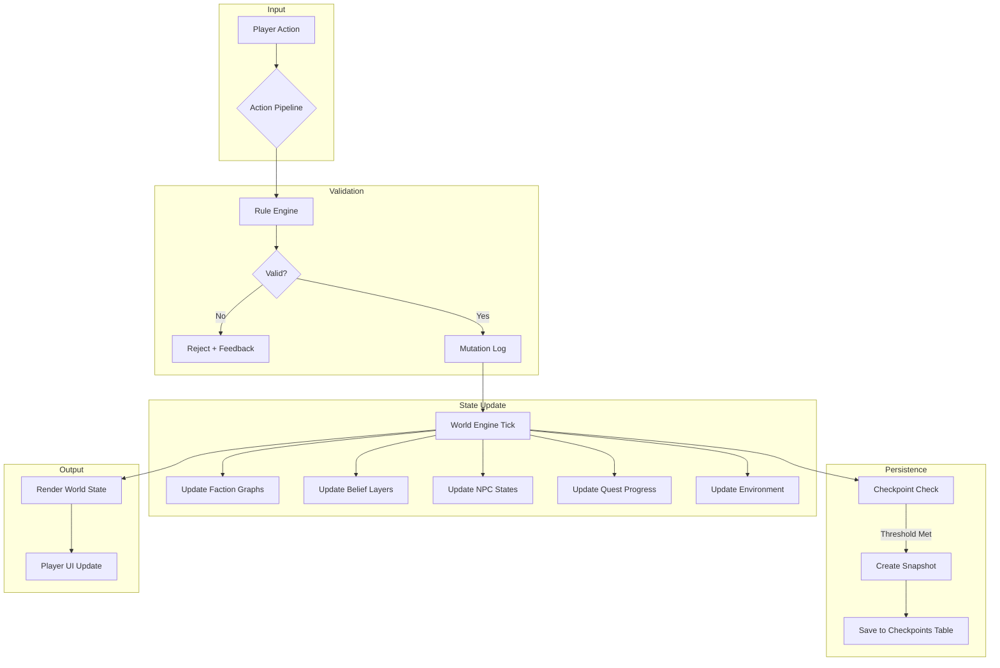
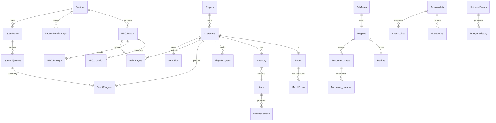

# 20 — Alpha Data Schema (Consolidated)

> Project Isekai — Luxfier Alpha
> Master Reference: `plans/00_MASTER_REFERENCE.md`
> Dependencies: ALL design layers (01–19)

Complete database schema for the Luxfier Alpha build. Every table, its primary key, foreign keys,
and purpose. This is the single source of truth for data modeling.

---

## 20.1 Schema Overview

All tables organized by domain. Each table lists columns, types, keys, and cross-references
to the design layer that defines its usage.

---

## 20.2 World & Cosmology Domain

### Realms
| Column | Type | Key | Notes |
|---|---|---|---|
| realm_id | INT | PK | |
| realm_name | VARCHAR(100) | UNIQUE | e.g., Chaos Realm, Lux-Ar |
| realm_type | ENUM('physical','metaphysical','transitional') | | |
| description | TEXT | | |
| rules_json | JSONB | | Physics, magic, time rules |

### Regions
| Column | Type | Key | Notes |
|---|---|---|---|
| region_id | INT | PK | |
| realm_id | INT | FK → Realms | |
| region_name | VARCHAR(100) | | |
| biome_type | VARCHAR(50) | | forest, mountain, abyss, urban, coastal |
| danger_level | INT | | 1–10 |
| description | TEXT | | |
| climate_json | JSONB | | Weather patterns, seasonal effects |

### SubAreas
| Column | Type | Key | Notes |
|---|---|---|---|
| subarea_id | INT | PK | |
| region_id | INT | FK → Regions | |
| subarea_name | VARCHAR(100) | | |
| subarea_type | VARCHAR(50) | | dungeon, settlement, shrine, wild |
| coordinates_json | JSONB | | x, y, z or named anchors |
| description | TEXT | | |

### TimeModel
| Column | Type | Key | Notes |
|---|---|---|---|
| time_id | INT | PK | |
| realm_id | INT | FK → Realms | |
| flow_rate | DECIMAL(5,2) | | Relative to real time |
| current_era | VARCHAR(50) | | |
| current_cycle | INT | | Lux-Ar pulse cycle |
| temporal_debt | DECIMAL(10,2) | | Accumulated time distortion |

### Epochs
| Column | Type | Key | Notes |
|---|---|---|---|
| epoch_id | INT | PK | |
| realm_id | INT | FK → Realms | |
| epoch_name | VARCHAR(100) | | e.g., Fracture of Radiance |
| sequence_order | INT | | 1, 2, 3... |
| start_year | INT | | In Amber Years (A.A.) |
| end_year | INT | | Null if final/current |
| base_difficulty | INT | | 1–10 |
| world_template_id| INT | | Reference to archetype |

---

## 20.3 Races & Species Domain

### Races
| Column | Type | Key | Notes |
|---|---|---|---|
| race_id | INT | PK | |
| race_name | VARCHAR(50) | UNIQUE | Elfin, Beastkin, Succubus, etc. |
| sub_race | VARCHAR(50) | | Common Elf, Terran Beastkin, etc. |
| base_str | INT | | |
| base_agi | INT | | |
| base_int | INT | | |
| base_cha | INT | | |
| base_end | INT | | |
| base_luk | INT | | |
| morph_capable | BOOLEAN | | |
| morph_type | VARCHAR(50) | | Full, partial, none |
| racial_traits_json | JSONB | | Unique abilities, restrictions |
| mandatory_drawbacks_json | JSONB | | For Succubi, Sanguinarians |

### MorphForms
| Column | Type | Key | Notes |
|---|---|---|---|
| form_id | INT | PK | |
| race_id | INT | FK → Races | |
| form_name | VARCHAR(100) | | |
| stat_modifiers_json | JSONB | | STR+, AGI-, etc. |
| end_cost | INT | | Per-tick maintenance |
| duration_max | INT | | In game ticks |
| cooldown | INT | | Ticks before re-morph |
| restrictions_json | JSONB | | Combat-only, requires END threshold |

---

## 20.4 Magic & Combat Domain

### MagicDisciplines
| Column | Type | Key | Notes |
|---|---|---|---|
| discipline_id | INT | PK | |
| discipline_name | VARCHAR(50) | UNIQUE | Ruin, Flux, Veil, Bind, Life |
| source_type | VARCHAR(50) | | Soul, environmental, artifact, corrupted |
| description | TEXT | | |
| forbidden_subtypes_json | JSONB | | Soul Rend, Time Fracture, etc. |

### Spells
| Column | Type | Key | Notes |
|---|---|---|---|
| spell_id | INT | PK | |
| discipline_id | INT | FK → MagicDisciplines | |
| spell_name | VARCHAR(100) | | |
| tier | INT | | 1–4 |
| mana_cost | INT | | |
| soul_cost | DECIMAL(3,2) | | For forbidden spells |
| end_cost | INT | | |
| cooldown | INT | | |
| effects_json | JSONB | | Damage, healing, buffs, debuffs |
| requirements_json | JSONB | | Level, INT, race restrictions |

### Weapons
| Column | Type | Key | Notes |
|---|---|---|---|
| weapon_id | INT | PK | |
| weapon_name | VARCHAR(100) | | |
| weapon_type | VARCHAR(50) | | Melee, ranged, hybrid |
| damage_base | INT | | |
| damage_type | VARCHAR(50) | | Physical, magical, hybrid |
| infusion_slot | BOOLEAN | | Can accept runes |
| durability_max | INT | | |
| requirements_json | JSONB | | STR, level, race |

### CombatStyles
| Column | Type | Key | Notes |
|---|---|---|---|
| style_id | INT | PK | |
| style_name | VARCHAR(50) | | |
| stat_focus | VARCHAR(50) | | STR, AGI, INT |
| compatible_weapons_json | JSONB | | Weapon type list |
| special_moves_json | JSONB | | Morph-integrated moves |

---

## 20.5 Belief & WTOL Domain

### BeliefLayers
| Column | Type | Key | Notes |
|---|---|---|---|
| belief_id | INT | PK | |
| entity_id | INT | | FK → Characters or NPC_Master |
| entity_type | ENUM('player','npc') | | |
| belief_type | ENUM('CB','FB','PB','WT','WTOL') | | |
| content_json | JSONB | | What they believe |
| confidence | DECIMAL(3,2) | | 0.00–1.00 |
| source | VARCHAR(100) | | Origin of belief |
| last_updated | TIMESTAMP | | |

### WTOLState
| Column | Type | Key | Notes |
|---|---|---|---|
| wtol_id | INT | PK | |
| entity_id | INT | | |
| entity_type | ENUM('player','npc') | | |
| truth_layer | ENUM('ground_truth','partial','misinformation','unknown') | | |
| revealed_facts_json | JSONB | | What has been actually revealed |
| pending_reveals_json | JSONB | | Queued for discovery |

---

## 20.6 Faction & Politics Domain

### Factions
| Column | Type | Key | Notes |
|---|---|---|---|
| faction_id | INT | PK | |
| faction_name | VARCHAR(100) | UNIQUE | |
| faction_type | VARCHAR(50) | | Government, guild, cult, military, independent |
| influence_score | INT | | 0–100 |
| territory_json | JSONB | | Region IDs controlled |
| resource_pool_json | JSONB | | Gold, materials, population |
| beliefs_json | JSONB | | Faction-level belief state |
| leader_npc_id | INT | FK → NPC_Master (nullable) | |

### FactionRelationships
| Column | Type | Key | Notes |
|---|---|---|---|
| rel_id | INT | PK | |
| faction_a_id | INT | FK → Factions | |
| faction_b_id | INT | FK → Factions | |
| relationship_type | ENUM('alliance','neutral','rivalry','war') | | |
| weight | INT | | –100 to +100 |
| last_event_id | INT | FK → MutationLog (nullable) | |

---

## 20.7 NPC Domain

### NPC_Master
| Column | Type | Key | Notes |
|---|---|---|---|
| npc_id | INT | PK | |
| name | VARCHAR(100) | | |
| race_id | INT | FK → Races | |
| npc_type | VARCHAR(50) | | Story, faction, merchant, combat, random, legendary |
| persona_prompt | TEXT | | **AI DM Hook**: High-level background, goals, and core identity |
| quirks_json | JSONB | | **AI DM Hook**: List of distinctive behaviors or speech patterns |
| voice_descriptor | VARCHAR(255) | | **AI DM Hook**: Tone, accent, or vocal style |
| faction_id | INT | FK → Factions (nullable) | |
| level | INT | | |
| base_stats_json | JSONB | | STR/AGI/INT/CHA/END/LUK |
| skill_set_json | JSONB | | |
| morph_capacity | BOOLEAN | | |
| disposition | VARCHAR(50) | | friendly, neutral, hostile, etc. |

### NPC_State (M19 Resonance)
| Column | Type | Key | Notes |
|---|---|---|---|
| npc_id | INT | FK → NPC_Master | |
| trust | INT | | 0-100 |
| fear | INT | | 0-100 |
| gratitude | INT | | 0-100 |
| resentment | INT | | 0-100 |
| emotional_history_json | JSONB | | List of recent events affecting metrics |

### NPC_Dialogue (Fallback & Static)
| Column | Type | Key | Notes |
|---|---|---|---|
| dialogue_id | INT | PK | |
| npc_id | INT | FK → NPC_Master | |
| trigger_conditions_json | JSONB | | Specific triggers for Tutorial/Strict sequences |
| dialogue_text | TEXT | | Static fallback if AI DM synthesis is bypassed |
| response_options_json | JSONB | | Player choices (Static) |
| outcome_json | JSONB | | Quest updates, reputation, belief |

---

## 20.8 Quest Domain

### QuestMaster
| Column | Type | Key | Notes |
|---|---|---|---|
| quest_id | INT | PK | |
| title | VARCHAR(200) | | |
| quest_type | VARCHAR(50) | | Canonical, faction, emergent, artifact, exploration, challenge |
| description | TEXT | | |
| faction_id | INT | FK → Factions (nullable) | |
| reward_xp | INT | | |
| reward_items_json | JSONB | | |
| dependencies_json | JSONB | | Pre-requisite quest IDs |
| creation_source | VARCHAR(50) | | AI DM, canonical, player-triggered |
| visibility_flag | BOOLEAN | | Hidden until trigger |

### QuestObjectives
| Column | Type | Key | Notes |
|---|---|---|---|
| objective_id | INT | PK | |
| quest_id | INT | FK → QuestMaster | |
| description | TEXT | | |
| objective_type | ENUM('primary','optional','hidden') | | |
| completion_flag | BOOLEAN | | |
| progress_value | INT | | 0–100 |

### QuestProgress
| Column | Type | Key | Notes |
|---|---|---|---|
| progress_id | INT | PK | |
| character_id | INT | FK → Characters | |
| quest_id | INT | FK → QuestMaster | |
| objective_id | INT | FK → QuestObjectives | |
| progress_value | INT | | |
| status | ENUM('active','completed','failed') | | |
| timestamp | TIMESTAMP | | |

---

## 20.9 Player & Character Domain

### Characters
| Column | Type | Key | Notes |
|---|---|---|---|
| character_id | INT | PK | |
| player_id | INT | FK → Players | |
| name | VARCHAR(100) | | |
| race_id | INT | FK → Races | |
| level | INT | | |
| xp | INT | | |
| str | INT | | |
| agi | INT | | |
| int_stat | INT | | |
| cha | INT | | |
| end_stat | INT | | |
| luk | INT | | |
| hp | INT | | |
| mp | INT | | |
| soul_integrity | DECIMAL(5,2) | | 0.00–100.00 |
| morph_state_json | JSONB | | Current form, duration remaining |
| created_at | TIMESTAMP | | |

### PlayerProgress
| Column | Type | Key | Notes |
|---|---|---|---|
| progress_id | INT | PK | |
| character_id | INT | FK → Characters | |
| total_stat_points | INT | | |
| total_skill_points | INT | | |
| total_morph_points | INT | | |
| last_level_up | TIMESTAMP | | |

### Inventory
| Column | Type | Key | Notes |
|---|---|---|---|
| inv_id | INT | PK | |
| character_id | INT | FK → Characters | |
| item_id | INT | FK → Items | |
| quantity | INT | | |
| equipped_flag | BOOLEAN | | |
| durability | INT | | |
| infusion_id | INT | FK → Runes (nullable) | |
| location | VARCHAR(50) | | bag, quickslot |

### Items
| Column | Type | Key | Notes |
|---|---|---|---|
| item_id | INT | PK | |
| item_name | VARCHAR(100) | | |
| item_type | VARCHAR(50) | | weapon, armor, consumable, material, rune, artifact, relic |
| rarity | VARCHAR(50) | | common, uncommon, rare, legendary, canonical |
| base_stats_json | JSONB | | |
| effects_json | JSONB | | |
| weight | DECIMAL(5,2) | | |
| stackable | BOOLEAN | | |
| max_stack | INT | | |
| lore_text | TEXT | | |

---

## 20.10 Encounter Domain

### Encounter_Master
| Column | Type | Key | Notes |
|---|---|---|---|
| encounter_id | INT | PK | |
| name | VARCHAR(100) | | |
| encounter_type | VARCHAR(50) | | combat, social, environmental, rare, legendary |
| spawn_probability | DECIMAL(5,4) | | 0.0000–1.0000 |
| region_id | INT | FK → Regions | |
| time_conditions_json | JSONB | | Day/night, era, season |
| trigger_conditions_json | JSONB | | Player level, faction, quest state |
| lore_link | INT | FK → HistoricalEvents (nullable) | |

### Encounter_Instance
| Column | Type | Key | Notes |
|---|---|---|---|
| instance_id | INT | PK | |
| encounter_id | INT | FK → Encounter_Master | |
| location_json | JSONB | | |
| timestamp | TIMESTAMP | | |
| spawned_flag | BOOLEAN | | |
| active_objectives_json | JSONB | | |

---

## 20.11 Timeline & History Domain

### HistoricalEvents
| Column | Type | Key | Notes |
|---|---|---|---|
| event_id | INT | PK | |
| era | VARCHAR(50) | | |
| event_name | VARCHAR(200) | | |
| event_type | ENUM('canonical','emergent','player_triggered') | | |
| description | TEXT | | |
| timestamp_game | BIGINT | | In-game time |
| canon_lock | ENUM('hard','soft','local','ephemera') | | |
| triggered_by | INT | FK → Characters (nullable) | |
| faction_impact_json | JSONB | | |

### EmergentHistory
| Column | Type | Key | Notes |
|---|---|---|---|
| eh_id | INT | PK | |
| session_id | INT | FK → SessionMeta | |
| event_description | TEXT | | |
| belief_impact_json | JSONB | | |
| faction_impact_json | JSONB | | |
| timestamp | TIMESTAMP | | |

---

## 20.12 Session & Persistence Domain

### MutationLog
| Column | Type | Key | Notes |
|---|---|---|---|
| event_id | BIGINT | PK | |
| session_id | INT | FK → SessionMeta | |
| timestamp | TIMESTAMP | | |
| event_type | VARCHAR(100) | | |
| payload_json | JSONB | | |
| hash | VARCHAR(64) | | SHA-256 |
| prev_hash | VARCHAR(64) | | Chain link |

### Checkpoints
| Column | Type | Key | Notes |
|---|---|---|---|
| checkpoint_id | INT | PK | |
| session_id | INT | FK → SessionMeta | |
| snapshot_blob | BYTEA | | Compressed full state |
| event_id_at_snapshot | BIGINT | FK → MutationLog | |
| hash_at_snapshot | VARCHAR(64) | | |
| created_at | TIMESTAMP | | |

### SaveSlots
| Column | Type | Key | Notes |
|---|---|---|---|
| slot_id | INT | PK | |
| character_id | INT | FK → Characters | |
| checkpoint_id | INT | FK → Checkpoints | |
| slot_type | ENUM('manual','auto') | | |
| label | VARCHAR(100) | | |
| created_at | TIMESTAMP | | |

### SessionMeta
| Column | Type | Key | Notes |
|---|---|---|---|
| session_id | INT | PK | |
| character_id | INT | FK → Characters | |
| start_time | TIMESTAMP | | |
| end_time | TIMESTAMP | | |
| event_count | INT | | |
| last_checkpoint_id | INT | FK → Checkpoints (nullable) | |

---

## 20.13 Crafting Domain

### CraftingRecipes
| Column | Type | Key | Notes |
|---|---|---|---|
| recipe_id | INT | PK | |
| recipe_name | VARCHAR(100) | | |
| required_materials_json | JSONB | | Item IDs and quantities |
| required_runes_json | JSONB | | Optional rune IDs |
| skill_level_required | INT | | |
| success_chance | DECIMAL(3,2) | | 0.00–1.00 |
| result_item_id | INT | FK → Items | |

### CraftingLog
| Column | Type | Key | Notes |
|---|---|---|---|
| log_id | INT | PK | |
| character_id | INT | FK → Characters | |
| recipe_id | INT | FK → CraftingRecipes | |
| materials_used_json | JSONB | | |
| success_flag | BOOLEAN | | |
| timestamp | TIMESTAMP | | |

---

## 20.14 Anti-Exploit Domain

### AntiExploitLog
| Column | Type | Key | Notes |
|---|---|---|---|
| log_id | INT | PK | |
| character_id | INT | FK → Characters | |
| exploit_type | VARCHAR(50) | | |
| detection_method | VARCHAR(100) | | |
| action_taken | VARCHAR(100) | | |
| timestamp | TIMESTAMP | | |

### ReloadTracker
| Column | Type | Key | Notes |
|---|---|---|---|
| tracker_id | INT | PK | |
| character_id | INT | FK → Characters | |
| session_id | INT | FK → SessionMeta | |
| reload_count | INT | | |
| world_drift_applied | BOOLEAN | | |
| timestamp | TIMESTAMP | | |

---

## 20.15 Legacy & Endgame Domain

### PlayerLegacy
| Column | Type | Key | Notes |
|---|---|---|---|
| legacy_id | INT | PK | |
| player_id | INT | FK → Players | |
| total_playthroughs | INT | | |
| world_shaping_score | INT | | |
| legacy_unlocks_json | JSONB | | |
| created_at | TIMESTAMP | | |

### PlaythroughSummary
| Column | Type | Key | Notes |
|---|---|---|---|
| playthrough_id | INT | PK | |
| player_id | INT | FK → Players | |
| character_id | INT | FK → Characters | |
| epoch_id | INT | FK → Epochs | Which historical window? |
| duration_seconds | BIGINT | | |
| faction_history_json | JSONB | | |
| canonical_contributions_json | JSONB | | |
| artifacts_found_json | JSONB | | |
| myth_status | ENUM | | Canonized, Demonized, Forgotten |

### LegacyImpact
| Column | Type | Key | Notes |
|---|---|---|---|
| impact_id | INT | PK | |
| source_character_id| INT | FK → Characters | The ancestor |
| target_player_id | INT | FK → Players | The owner |
| bloodline_perks_json| JSONB | | Stat buffs for descendants |
| soul_echo_json | JSONB | | Retained knowledge/skills |
| anomaly_triggers_json| JSONB | | Scripted events (e.g., haunting) |
| is_consumed | BOOLEAN | | |

---

## 20.16 Operational Flow Diagram

## 20.17 Entity-Relationship Diagram

---

## 20.18 Table Count Summary

| Domain | Tables | Count |
|---|---|---|
| World & Cosmology | Realms, Regions, SubAreas, TimeModel, Epochs | 5 |
| Races & Species | Races, MorphForms | 2 |
| Magic & Combat | MagicDisciplines, Spells, Weapons, CombatStyles | 4 |
| Belief & WTOL | BeliefLayers, WTOLState | 2 |
| Factions | Factions, FactionRelationships | 2 |
| NPCs | NPC_Master, NPC_Location, NPC_Dialogue | 3 |
| Quests | QuestMaster, QuestObjectives, QuestProgress | 3 |
| Player/Character | Characters, PlayerProgress, Inventory, Items | 4 |
| Encounters | Encounter_Master, Encounter_Instance | 2 |
| Timeline/History | HistoricalEvents, EmergentHistory | 2 |
| Session/Persistence | MutationLog, Checkpoints, SaveSlots, SessionMeta | 4 |
| Crafting | CraftingRecipes, CraftingLog | 2 |
| Anti-Exploit | AntiExploitLog, ReloadTracker | 2 |
| Legacy/Endgame | PlayerLegacy, PlaythroughSummary, LegacyImpact | 3 |
| **Total** | | **40** |
